# JSR

JSR 将 RAW 连拍重建为高分辨率线性 RGB，面向高动态摄影，重点约束暗部亮度、颜色响应与周期伪影。4 至 14 帧连拍均可获得良好的重建效果。更高帧数暂不被支持。

JSR reconstructs RAW bursts into high-resolution linear RGB for high dynamic range photography, with explicit control of shadow brightness, color response, and periodic artifacts. Bursts of 4 to 14 frames can all yield good reconstruction results. Bursts longer than 14 frames are not currently supported.

[下载 EXE / Download EXE](https://github.com/y-g-jiang/Jiangtherapee-Super-Resolution-World-Best/releases/latest) · [仅需四张 / Just four frames](#burst-examples) · [高张数对比 / Longer bursts](#longer-bursts) · [论文实验图 / Paper comparisons](#paper-comparisons) · [连续数据流 / Data flow](#data-flow) · [中文介绍](#chinese) · [English](#english) · [论文 / Paper](#paper)

## 效果对比 / Results

### 仅需四张 / Just four frames

下面三组实拍效果，仅需四张 RAW 连拍即可获得。作为张数参照，松下 LUMIX G9II 的手持高分辨率模式合成 16 张，而这里的 JSR 结果仅使用四张输入。

Just four RAW frames produce each of the three results below. For a frame-count reference, the Panasonic LUMIX G9II combines 16 frames in handheld high-resolution mode; these JSR results use only four.

所有对照均为左侧超分前、右侧 JSR 超分后。默认展示高倍率局部，下方可展开较大范围的同址对照。

Every pair shows the input view on the left and the JSR result on the right. Enlarged details appear first; expand each example for a wider view of the same area.

#### 窗框与细栏杆 / Window frames and narrow bars

[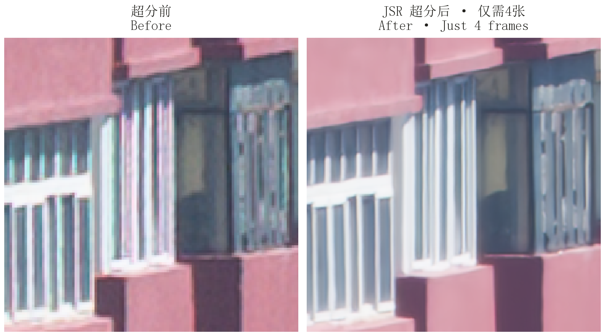](assets/readme/burst4-windows.png)

较大范围对照 / Wider view

[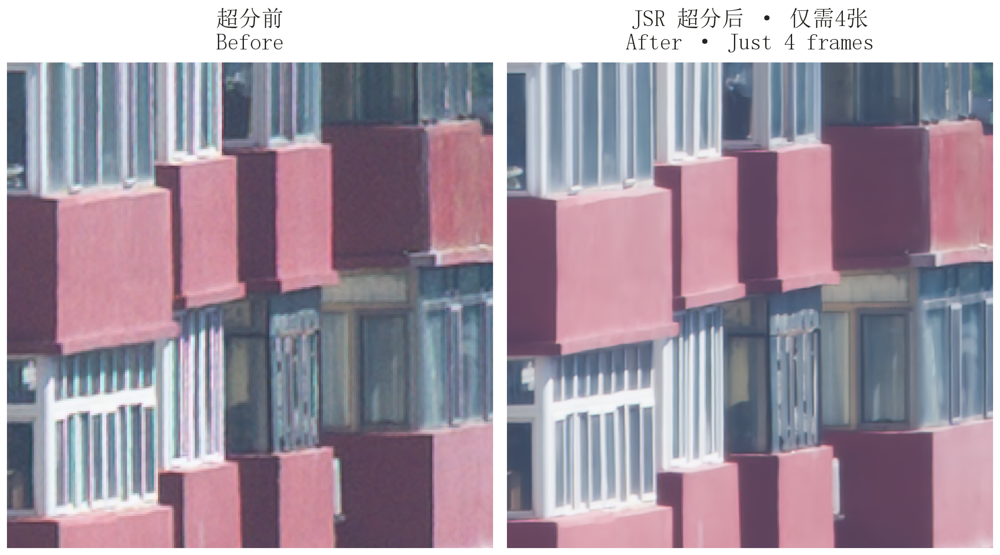](assets/readme/burst4-windows-overview.png)

#### 室外机细栅格 / Fine air-conditioner grille

[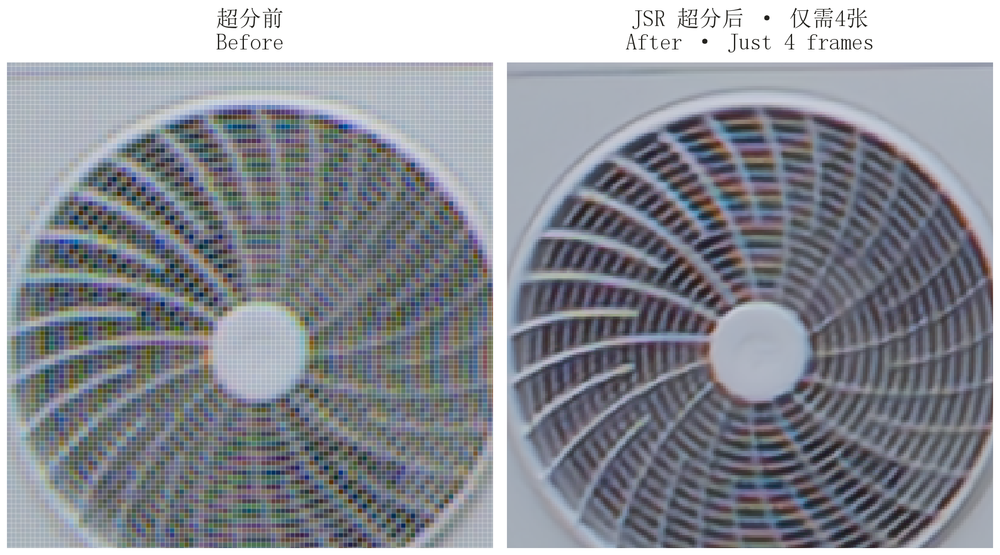](assets/readme/burst4-grille.png)

较大范围对照 / Wider view

[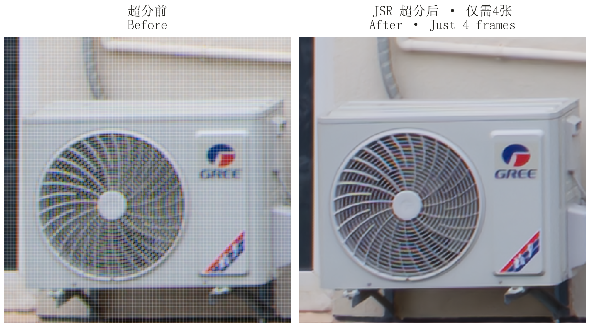](assets/readme/burst4-grille-overview.png)

#### 楼顶立面 / Rooftop facade

[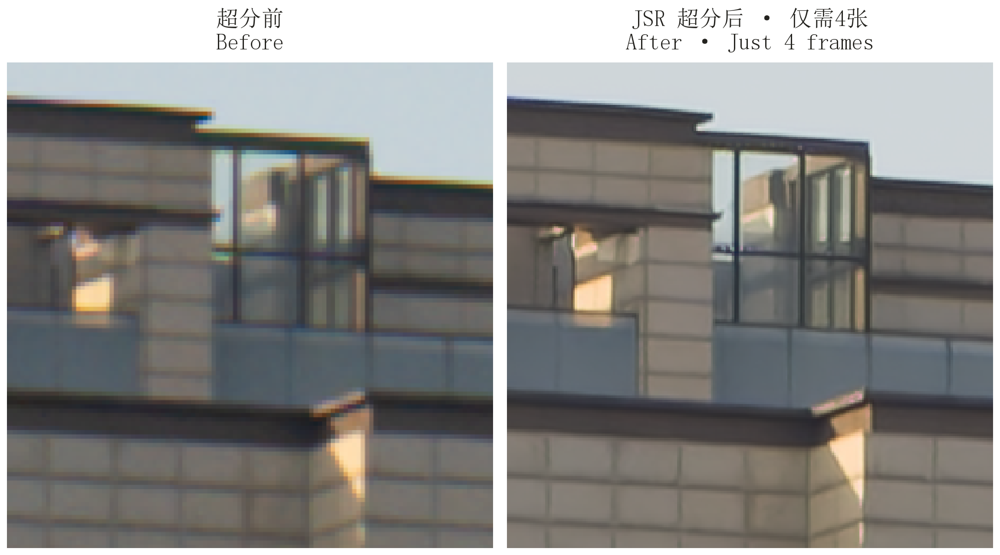](assets/readme/burst4-facade.png)

较大范围对照 / Wider view

[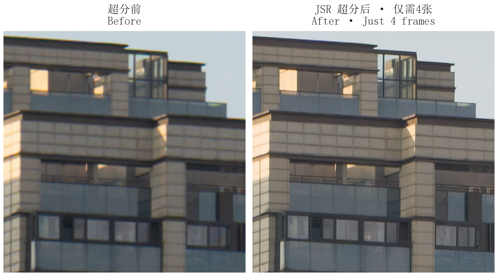](assets/readme/burst4-facade-overview.png)

### 更多帧的实拍对比 / Results from longer bursts

#### 14 张：石雕纹样 / 14 frames: carved stone

[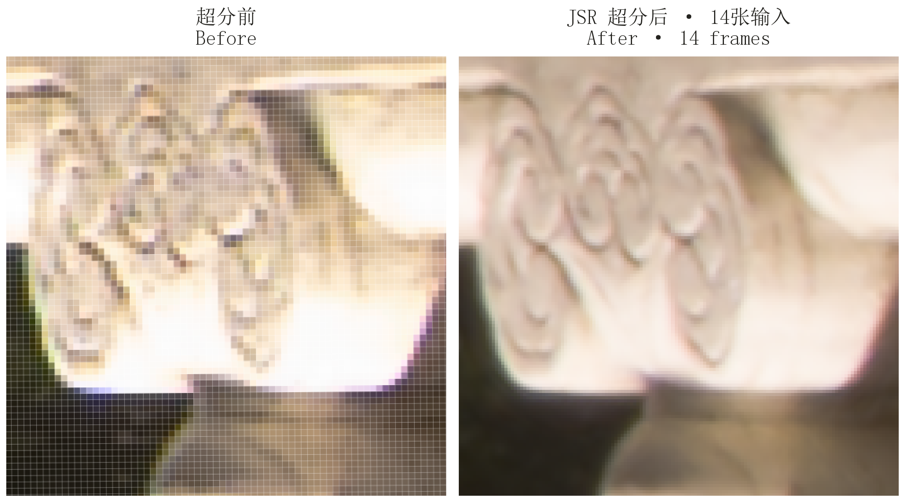](assets/readme/burst14-stone.png)

较大范围对照 / Wider view

[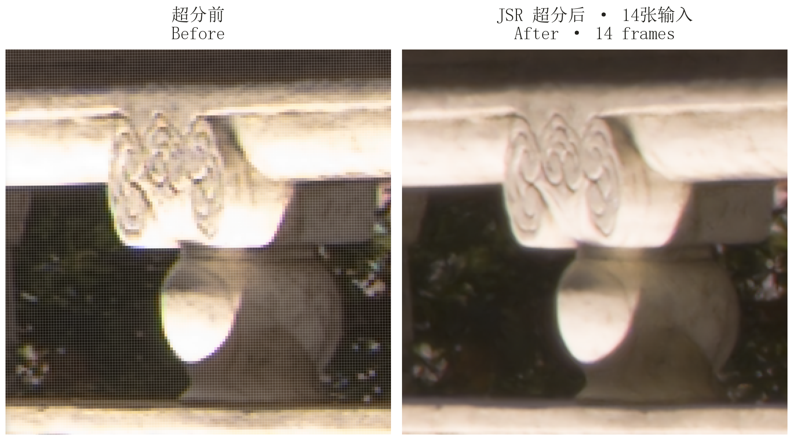](assets/readme/burst14-stone-overview.png)

#### 高张数：暗部结构 / Longer burst: shadow structure

[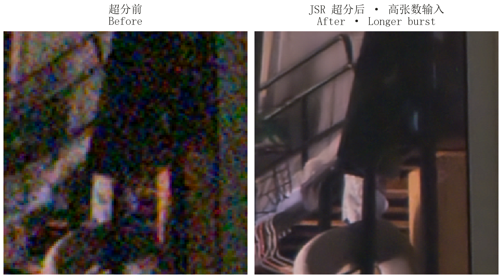](assets/readme/burst-high-shadows.png)

较大范围对照 / Wider view

[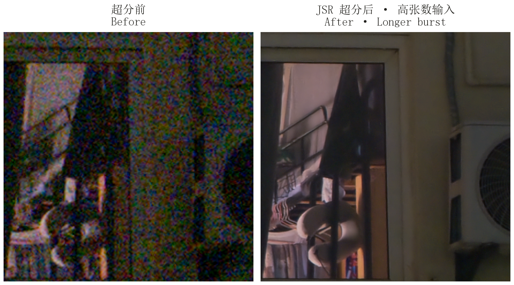](assets/readme/burst-high-shadows-overview.png)

实拍图像与显示 / Images and display

以上五组为作者提供的实拍截图，按实际输入张数分组。前后画面经特征匹配校正尺度、旋转和平移，再裁取相同区域；局部相对较大范围对照放大两倍。整理时不调曝光、颜色或锐度。室外机与石雕的超分前画面保留 Photoshop 像素网格，该网格属于编辑器显示。

These five examples are author-supplied screenshots, grouped by input frame count. Feature matching corrects scale, rotation, and translation before cropping the same region. Details are shown at twice the magnification of the wider views. Exposure, color, and sharpness are unchanged. The input views of the grille and carved stone retain Photoshop's pixel-grid overlay, which belongs to the editor display.

## 论文中的对比 / Comparisons from the paper

论文对比图，点击可查看原尺寸。 / Figures from the paper. Click to view at full resolution.

### 色散下的细节 / Detail under chromatic aberration

[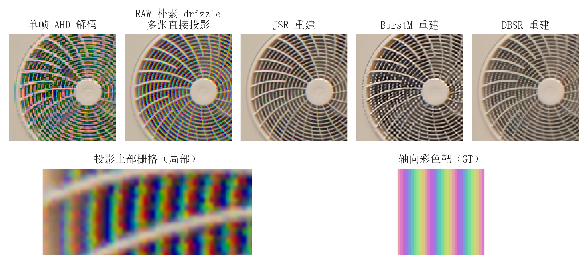](assets/readme/lca-stripe-bridge.png)

上排比较室外机同一处细栅格，五列依次为单帧 AHD 解码、RAW 朴素 drizzle 多张直接投影、JSR 重建、BurstM 重建、DBSR 重建。单帧取同组参考帧，用 AHD 对完整 RGGB 图像解码，再将每个原生像素原样显示为 2×2 色块，裁取同址局部，不作插值上采样；其余四列使用全部 14 帧。观测为无噪声合成，R/G/B 位移为 −0.5/0/+0.5 个输入像素，均不作色散补偿。各列共用曝光增益、颜色矩阵和 sRGB 显示编码，不施加 AsShotNeutral。JSR 保留了细栅格结构，未形成 BurstM 结果中可见的边缘锁定蜂窝纹。RAW 朴素 drizzle 以空间核加权汇总样本，不经过学习式细化；该投影与 JSR 使用精确运动场，BurstM、DBSR 使用原生对齐。

The top row compares the same fine grille in five columns: single-frame AHD, naive RAW drizzle (multi-frame direct projection), JSR reconstruction, BurstM reconstruction, and DBSR reconstruction. The single-frame baseline uses AHD to demosaic the burst's full reference frame. Each native pixel is then displayed as an unchanged 2×2 block, with the same spatial crop and no interpolated upsampling. The other four columns use all 14 frames. The synthetic observations are noise-free, with R/G/B displacements of −0.5/0/+0.5 input pixels and no LCA compensation. All columns share the exposure gain, color matrix, and sRGB display encoding, without AsShotNeutral. JSR preserves the fine grille without the edge-locked honeycomb pattern visible in BurstM. Naive RAW drizzle aggregates samples with spatial-kernel weighting and no learned refinement. The projection and JSR use exact motion fields; BurstM and DBSR use native alignment.

下排把 RAW 投影中的网格色带与独立生成的轴向彩色靶联系起来。下面的控制实验进一步检查：真实条纹只沿一个方向变化时，重建是否会额外生成另一方向的周期纹。

The lower row connects the colored bands in the RAW projection to an independently generated axial color target. The following controls test whether reconstruction introduces periodic patterns along an axis where the true signal is constant.

### 彩色条纹的重建 / Reconstructing color stripes

[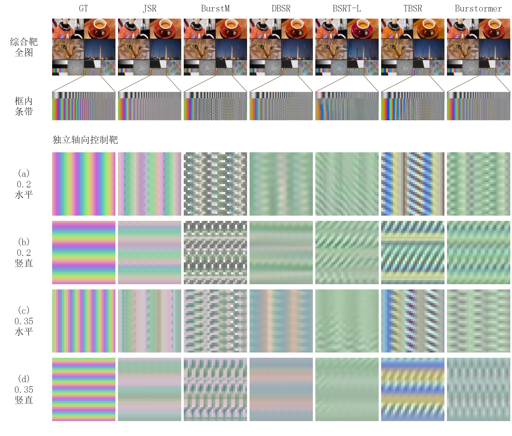](assets/readme/color-stripe-comparison.png)

上部先给出 GT 与六种模型的完整重建，再展示框内条带，保留局部失效的全图背景。下部四行是独立生成的无 LCA、无噪声轴向控制靶，不是上图裁块。真实条纹仅沿一个方向变化，正交方向应当恒定，因此额外的棋盘或交叉纹理可以与真实色彩变化分开检查。JSR 减少了错误方向的周期纹，同时也衰减了部分真实色度幅度；论文将这两项分别测量。

The upper section shows GT and all six full-image reconstructions before enlarging the marked stripes, retaining the context of the local failure. The four lower rows are independent axial controls with no LCA or noise, not crops of the upper image. Their signal varies along only one axis, so added checkerboard or cross-axis patterns can be inspected separately from real color variation. JSR reduces the spurious cross-axis patterns while also attenuating some true chroma amplitude; the paper measures both effects separately.

轴向控制条件 / Axial-control conditions

综合靶使用 14 帧 clear-pupil 观测与各模型自身对齐。下部控制靶静态重复 14 帧；(a,b) 频率为 0.20 周/原生像素，(c,d) 为 0.35，分别沿水平和竖直方向变化。JSR、BurstM 使用精确运动场，其余模型保留原生对齐。轴向靶各列共用保持中性灰的颜色矩阵，不施加 AsShotNeutral 或逐模型调色；全部局部按最近邻放大。

The composite target uses 14 clear-pupil observations and each model's native alignment. The lower controls repeat a static frame 14 times. Rows (a,b) use 0.20 cycles per native pixel; (c,d) use 0.35, with horizontal and vertical variation. JSR and BurstM use exact motion fields; the remaining methods retain native alignment. All axial-target columns share a neutral-gray-preserving color matrix, without AsShotNeutral or per-model color adjustment. Local views use nearest-neighbor enlargement.

### 同一重建，提亮九档 / One reconstruction, a nine-stop lift

[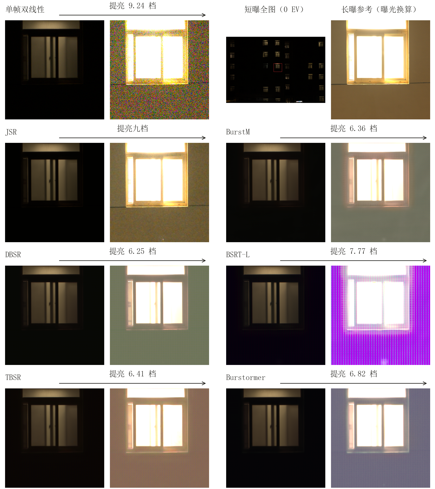](assets/readme/shadow-exposure-comparison.png)

每个方法的左右两图来自同一份线性输出。左图保持原曝光；右图中 JSR 提亮九档，其余方法各用一个全图标量增益，将平均显示亮度对齐 JSR。原曝光下主要能看到亮窗；提亮后，JSR 的暗墙层次和接缝显现，其他结果中的局部偏色、彩色噪声或周期纹也随之显现。右上角提供独立长曝光参考。

Each pair is rendered from the same linear reconstruction. The left image uses the original exposure. On the right, JSR receives a nine-stop lift; each other method uses one global scalar gain to match JSR's mean displayed brightness. At the original exposure, the bright window dominates the view. Lifting the shadows reveals the wall and its joints in JSR, as well as local color shifts, chromatic noise, or periodic patterns in the other results. An independent long-exposure reference appears at the upper right.

曝光、对齐与参考图 / Exposure, alignment, and reference

各多帧方法接收同一组 14 帧等曝光 RAW。短曝使用 Panasonic DC-S5M2，35 mm、1/50 s、f/5.6、ISO 640；各局部对应同一 512 × 512 原生区域。运动来源统一为 JSR 的实拍估计流：BurstM、DBSR、BSRT-L 接入显式流接口；TBSR、Burstormer 先按 CFA 子格预对齐，再保留原生学习式对齐。DBSR、TBSR、Burstormer 使用官方四倍输出，并仅在共同显示前于线性域缩小。

JSR 的提亮增益为 512；其余方法的实际档数标在箭头上。显示使用固定颜色矩阵和 sRGB 编码，不施加 AsShotNeutral，不拟合黑位或分通道增益。长曝按 EXIF 换算曝光，用于核对暗墙结构和颜色；其饱和窗区只作定位。九档表示重建后的曝光调整幅度，不表示传感器动态范围增加九档。

All burst methods receive the same 14 equal-exposure RAW frames. The short exposure was captured with a Panasonic DC-S5M2 at 35 mm, 1/50 s, f/5.6, and ISO 640; every crop covers the same 512 × 512 native-pixel region. Motion comes from JSR's estimated flow: BurstM, DBSR, and BSRT-L use their explicit flow interfaces; TBSR and Burstormer receive CFA-sublattice prealignment and retain their learned alignment. DBSR, TBSR, and Burstormer use official 4× outputs, downsampled in the linear domain only for the common display.

JSR's display gain is 512; the gains for the other methods are labeled on the arrows. All use a fixed color matrix and sRGB encoding, without AsShotNeutral, black-offset fitting, or per-channel gain fitting. The long exposure is scaled using EXIF and serves as a qualitative reference for the dark wall; its saturated window is used only for localization. Nine stops describes editing latitude after reconstruction, not an increase in sensor dynamic range.

### 未知彗差 / Unknown coma

[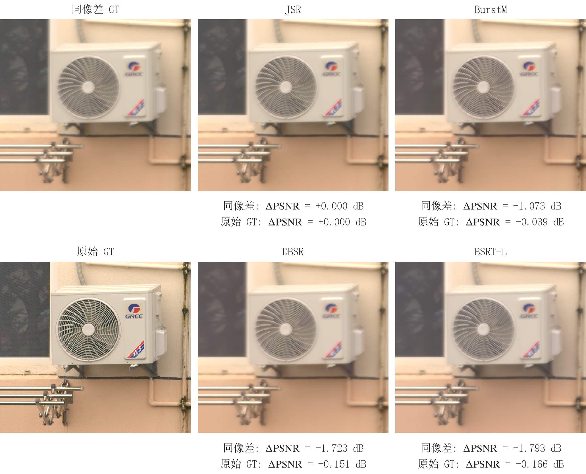](assets/readme/coma-comparison.png)

JSR、BurstM、DBSR、BSRT-L 使用同一组 14 帧无噪声 RAW 和精确运动场，不获得像差参数。彗差系数为 0.30 RMS waves，参考波长 550 nm。左上是同像差 GT，左下是额外施加 PSF 之前的原始实拍参考；每套参考的 ΔPSNR 均以 JSR 为零。这个实验分别考察对实际光学观测的重建和对额外像差之前图像的接近程度。

JSR, BurstM, DBSR, and BSRT-L receive the same 14 noise-free RAW frames and exact motion fields, without aberration parameters. The coma coefficient is 0.30 RMS waves at 550 nm. The upper-left image is matched-aberration GT; the lower-left image is the original photographic reference before the additional PSF. For each reference, ΔPSNR is relative to JSR. This separates reconstruction of the observed optical image from similarity to the image before the additional aberration.

更多对照位置 / Additional comparison slots

| 对照 / Comparison | 左侧 / Left | 右侧 / Right |
| :--- | :---: | :---: |
| 同场景帧数 / Same scene, different K | JSR · 4 frames · 待加入 / Pending | JSR · 14 frames · 待加入 / Pending |
| 其他方法 / Another method | 方法名与结果待加入 / Method and result pending | JSR · 待加入 / Pending |
| 运动局部 / Moving region | 单帧参考待加入 / Single-frame reference pending | JSR · 待加入 / Pending |

<!-- EXTRA_SLOTS: 这些行只预留版位，不作性能或已完成动态实验的声明。正式图片就位后，删除未使用行。 -->

## JSR 的连续数据流 / JSR data flow

[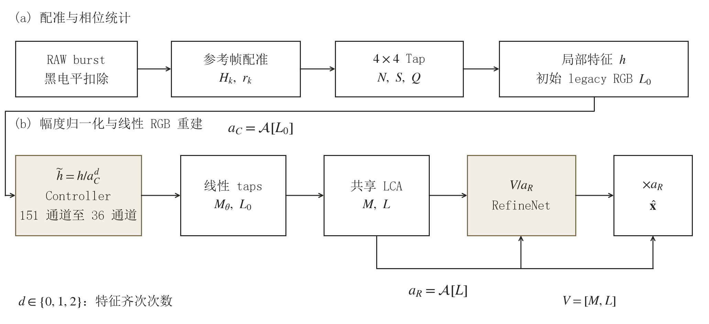](assets/readme/system-data-flow.png)

扣除黑电平的 RAW 连拍先配准到参考帧，再按颜色与亚像素相位累积 Tap 统计。Controller 根据归一化统计调节线性融合权重，形成 learned RGB，同时保留传统融合的 legacy RGB。启用 LCA 补偿时，两路 RGB 接受相同的通道几何变换，再送入 RefineNet。

Controller 的局部幅度由初始 legacy RGB 计算；RefineNet 的局部幅度由 LCA 变换后的 legacy RGB 重新计算。两者使用同一幅度算子，对应图中的 $a_C$ 与 $a_R$。RefineNet 在幅度归一化后的两路 RGB 上重建，再乘回 $a_R$，输出高分辨率线性 RGB。

Black-subtracted RAW frames are registered to a reference frame, then accumulated into Tap statistics by color and subpixel phase. The Controller uses normalized statistics to adjust linear fusion weights, producing learned RGB alongside a conventional legacy RGB estimate. When LCA correction is enabled, both RGB estimates receive the same channel-specific geometric transforms before entering RefineNet.

The Controller's local amplitude comes from the initial legacy RGB. RefineNet's amplitude is recomputed from legacy RGB after the LCA transform. Both use the same amplitude operator, giving $a_C$ and $a_R$ in the diagram. RefineNet reconstructs from the two amplitude-normalized RGB estimates, then restores $a_R$ to produce high-resolution linear RGB.

## 中文介绍

JSR 是面向 16-bit sensor-linear RAW burst 的监督式整幅重建系统，接收原生 RAW/DNG，输出高分辨率 linear RGB 和高位深图像。重建位于白平衡、显示编码和色调映射之前。系统可处理 3 至 6 帧的短连拍，也可利用高张数输入；使用真实帧数组织统计量和选择重建权重，不靠复制输入凑满固定帧数。

### 方法

1. 鲁棒对齐。先以全局单应解释主要运动，再结合参考帧约束、多帧一致性及可靠局部对应，拟合最高四次的二维残差场。控制点不足时降低模型阶数，减少重复纹理、低信噪比和 CFA 混叠造成的局部假匹配。
2. RAW 证据融合。按颜色与亚像素相位累积已对齐样本的计数、一阶和二阶统计。学习式控制器调节线性 Tap 权重，形成 learned RGB，同时保留传统融合的 legacy RGB；RefineNet 在两路 RGB 上完成重建。显式 LCA 补偿对两路表示使用一致的通道几何。
3. 局部强度尺度等变。由参与局部重建的全部已接受、已对齐 RAW 证据形成幅度坐标，按特征对输入强度的 0、1、2 次齐次性归一化。RefineNet 在无量纲域中处理结构和颜色，再乘回局部幅度。
4. 整幅一致执行。幅度定义和坐标在整幅图像上保持一致，分块计算保留感受野所需的 halo，避免每个 patch 独立归一化造成亮度、颜色或纹理接缝。

对输出像素的完整依赖支撑共同乘以正增益 $c$，在固定已接受对应和 LCA 变换、正确扣黑且缩放前后未削波时，重建映射满足：

$$
F_p(cX)=cF_p(X),\qquad c>0.
$$

因此，RefineNet 可以保留带 bias 的卷积和非线性激活，而最终输出不会产生与输入强度无关的固定亮度或颜色偏移。这里的尺度指强度尺度；该性质允许随信号同比缩放的误差。

### 配套研究：伪影控制与质量预估

通道共享的运动模型会留下色差引起的 R/G/B 相位残差。JSR 的研究将实拍 LCA、配对模拟、RAW 直接投影和轴向彩色靶联系起来，并通过冻结权重的可逆干预分析周期纹的生成与传播。JSR 的 RGB 后端在两路 RGB 及局部幅度沿一轴恒定时保持该恒定性；实际输入中已有的色度残差则另行测量其传递与清理效果。

逐 K 质量预估在运行 RefineNet 前，从当前 burst 的流场与 legacy RGB 提取采样距离、相位冗余、多频带可辨识性和内容频谱。预测时无需 GT；输出为相对共同 K14 参考的误差估计，以及新增一帧后的预期收益。质量指数在各 K 之间使用同一尺度，100 表示预测误差等于参考，50 表示两倍参考误差，可超过 100。该预测器的独立测试范围是固定光学响应、无添加噪声和精确平移；其用途是比较已采集序列，而非保证下一张尚未拍摄的照片会有多大收益。

## English

JSR is a supervised, full-image reconstruction system for 16-bit sensor-linear RAW bursts. It accepts native RAW/DNG files and produces high-resolution linear RGB and high-bit-depth images. Reconstruction precedes white balance, display encoding, and tone mapping. The system handles short bursts of 3 to 6 frames and can also use longer bursts. Statistics and reconstruction weights use the real frame count, without duplicating inputs to fill a fixed-length burst.

### Method

1. Robust alignment. A global homography explains the main motion. Reference-frame constraints, agreement across frames, and reliable local correspondences then constrain a two-dimensional residual field of up to degree four. The model drops to a lower degree when control points are insufficient, reducing local false matches in repetitive textures, low-SNR regions, and CFA aliasing.
2. RAW evidence fusion. Aligned samples contribute counts, first-order sums, and second-order statistics indexed by color and subpixel phase. A learned controller adjusts linear Tap weights to form learned RGB, alongside a conventional legacy RGB estimate. RefineNet reconstructs from both RGB estimates. Explicit LCA compensation uses consistent channel geometry for the two streams.
3. Local intensity-scale equivariance. All accepted, aligned RAW evidence contributing to local reconstruction determines the amplitude coordinates. Features are normalized according to their degree of homogeneity in input intensity: zero, one, or two. RefineNet processes structure and color in dimensionless coordinates, and the local amplitude is restored afterward.
4. Consistent full-image execution. The amplitude definition and coordinates remain consistent across the image. Tiled execution retains the halo required by the receptive field, avoiding brightness, color, and texture seams from independent patch normalization.

When all samples in an output pixel's complete dependency support receive the same positive gain $c$, the reconstruction satisfies the following relation, provided that accepted correspondences and LCA transforms are fixed, black-level subtraction is correct, and neither input is clipped:

$$
F_p(cX)=cF_p(X),\qquad c>0.
$$

RefineNet can therefore retain biased convolutions and nonlinear activations without introducing a fixed output brightness or color offset independent of input intensity. Scale here means intensity scale; errors that scale with the signal are still possible.

### Accompanying research: artifact control and quality prediction

A channel-shared motion model leaves R/G/B phase residuals caused by chromatic aberration. Our analysis connects real LCA, paired simulations, direct RAW projection, and axial color targets, using reversible interventions with frozen weights to study the generation and propagation of periodic patterns. JSR's RGB backend preserves constancy along an axis when both RGB inputs and the local amplitude are constant along that axis. Transmission and removal of chroma residuals already present in its inputs are measured separately.

The per-K quality predictor operates before RefineNet. It extracts sampling distances, phase redundancy, identifiability across frequency bands, and content spectra from the current burst's flow fields and legacy RGB. Prediction requires no GT and estimates error relative to a common K14 reference, as well as the benefit of an additional acquired frame. The quality index uses the same scale across K: 100 denotes the reference error, 50 denotes twice that error, and values above 100 are possible. Independent testing covers fixed optics, no added noise, and exact translations. The predictor compares acquired sequences; it does not guarantee the benefit of a frame that has not yet been captured.

## 实验摘要 / Selected measurements

### 辐射响应 / Radiometric response

[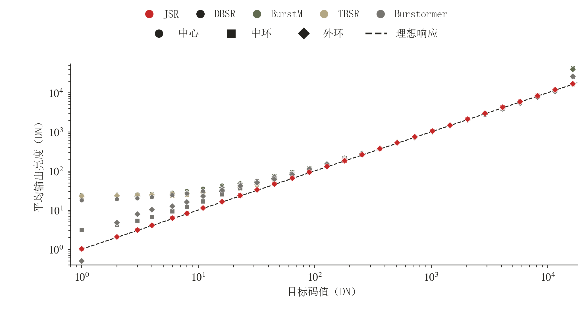](assets/readme/radiometric-response.png)

阶梯环靶固定空间几何，在恒定平台上扫描强度，并以高反差邻域检验上下文泄漏。与把强度绑定到空间位置的渐变靶相比，这样可以减少小幅位移和空间滤波对辐射响应测量的混淆。靶子在连续坐标中定义，以每像素 16 点空间积分生成观测；强度扫描使用 29 个离散码值，并在暗部加密。

The stepped-ring target holds geometry fixed while varying intensity on constant plateaus, with high-contrast surroundings used to test context leakage. Compared with a ramp that ties intensity to spatial position, this reduces the confounding effects of small shifts and spatial filtering on radiometric measurements. Targets are defined in continuous coordinates and sampled using 16-point spatial integration per pixel. The intensity sweep uses 29 discrete levels, sampled more densely in the shadows. The plot shows mean output intensity against target intensity in DN; circles, squares, and diamonds denote the center, middle ring, and outer ring. JSR is red; the dashed line is the identity response.

| 测量 / Measurement | JSR | 对照 / Comparison |
| :--- | ---: | :--- |
| 全域非线性残差 / Full-range nonlinear residual, 0 to 16383 DN | 0.223 DN | 次优 DBSR：36.686 DN；JSR 为其 1/164.6 / Next best, DBSR: 36.686 DN; JSR is 1/164.6 as large |
| 暗部非线性残差 / Shadow nonlinear residual, 0 to 127 DN | 0.245 DN | 次优 DBSR：2.587 DN；JSR 为其 1/10.56 / Next best, DBSR: 2.587 DN; JSR is 1/10.56 as large |
| 暗部恒等响应误差 / Shadow identity-response RMSE | 1.625 DN | 直接对输入码值评分 / Scored directly against input intensity |

本表来自 14 帧、无噪声、固定亚像素运动的阶梯环实验。前两项为相对各模型最佳仿射响应的 RMSE，衡量非线性，不是图像重建 RMSE；JSR 全域拟合斜率为 1.036843，保留全局增益差异的恒等响应 RMSE 为 158.500 DN。JSR、BurstM 为原生二倍输出；DBSR、TBSR、Burstormer 使用官方原始四倍权重，在各自输出的同一物理平台区域评分，不缩放输出。0.223 DN 对应所测 16383 DN 有效量程的 0.00136%。

This table uses 14-frame, noise-free stepped-ring bursts with fixed subpixel motion. The first two rows measure RMSE relative to each model's best affine response, quantifying nonlinearity rather than image reconstruction error. JSR's fitted full-range slope is 1.036843; its identity-response RMSE, which retains global gain error, is 158.500 DN. JSR and BurstM use native 2× outputs. DBSR, TBSR, and Burstormer use official original 4× weights, scored on the same physical plateau regions without output resizing. The 0.223 DN residual is 0.00136% of the tested 16383 DN effective range.

### 未知像差与逐 K 质量 / Unknown aberrations and per-K quality

| 实验 / Experiment | 结果 / Result |
| :--- | :--- |
| 单场景、15 种未针对性微调的像差、六模型默认对齐 / One scene, 15 aberration conditions without targeted fine-tuning, six models with default alignment | JSR 在同像差与 clear-pupil 两套 GT 下均为 10 个第一、5 个第二 / JSR ranks first in 10 conditions and second in 5 under both matched-aberration and clear-pupil GT |
| 0.5-pixel LCA 单场景压力实验 / Single-scene 0.5-pixel LCA stress test | 联合 eRG/eBG RMSE 较最佳外部模型低 13.15% / Joint eRG/eBG RMSE is 13.15% lower than the best external model |
| 逐 K 相对损失预测 / Per-K relative-loss prediction | 20 幅独立测试图像、4,180 个用例：RMSE 1.082 dB，较仅帧数预测降低 52.21% / 20 independent test images and 4,180 cases: RMSE 1.082 dB, 52.21% lower than a frame-count-only predictor |
| 同图采样轨迹排序 / Within-image sampling-trajectory ranking | K2 至 K14 的 Spearman 相关系数逐图中位数为 0.899 至 0.968 / Per-image median Spearman correlations range from 0.899 to 0.968 across K2 to K14 |

LCA 指标中的 eRG、eBG 分别为 R−G、B−G 的重建误差；各模型使用论文指定的对齐配置，该颜色指标与蜂窝纹的局部周期指标分别评价。质量预测采用固定光学、无添加噪声及精确平移；GT 仅用于离线标签与评价。以上结果按各实验分别解释，不合并为总体 PSNR 排名。

For the LCA metric, eRG and eBG are reconstruction errors in R−G and B−G. Models use the alignment configurations specified in the paper; this color metric is evaluated separately from local periodic-pattern metrics. Quality prediction uses fixed optics, no added noise, and exact translations, with GT used only for offline labels and evaluation. These results describe their respective experiments, not an overall PSNR ranking.

[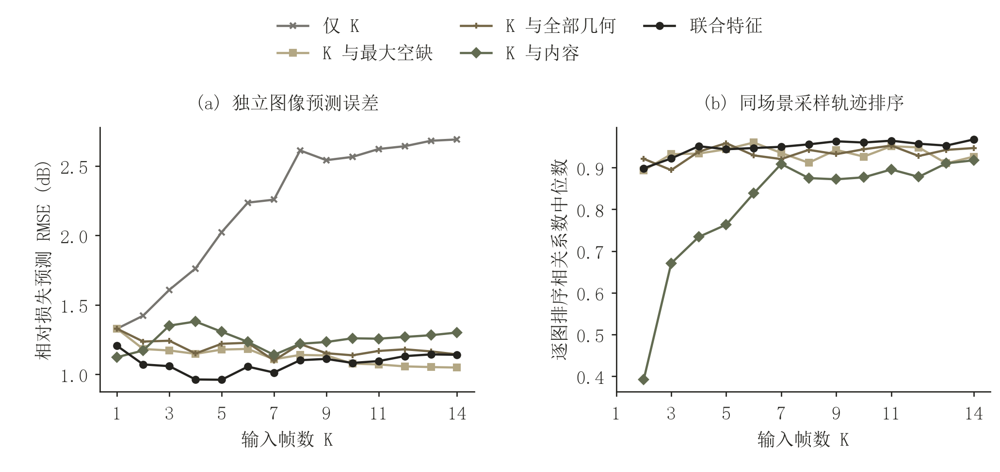](assets/readme/quality-prediction.png)

左侧为相对损失预测 RMSE，越低越好；右侧为同图轨迹排序相关系数中位数，越高越好。质量指数结合当前图像内容与采样几何，因此能区分帧数相同而采样轨迹不同的 burst。

Left: relative-loss prediction RMSE, lower is better. Right: median within-image trajectory-ranking correlation, higher is better. The five feature groups are K only, K with the largest sampling gap, K with all geometry features, K with content, and joint features. Combining image content with sampling geometry lets the predictor distinguish bursts with the same frame count but different sampling trajectories.

## 下载 / Download

JSR（Jiangtherapee Super Resolution）的 Windows x64 EXE 通过 [Releases](https://github.com/y-g-jiang/Jiangtherapee-Super-Resolution-World-Best/releases) 发布。请在对应版本的 Assets 中下载程序；运行要求及随附文件以该版本的发布说明为准。

The Windows x64 EXE for JSR (Jiangtherapee Super Resolution) is distributed through [Releases](https://github.com/y-g-jiang/Jiangtherapee-Super-Resolution-World-Best/releases). Download the application from the release's Assets section. Runtime requirements and accompanying files are described in the release notes.

本仓库用于二进制程序及配套论文的发布，不包含算法源代码或源码历史。

Binary releases are published here, and the paper will also be provided. This repository does not contain the algorithm's source code or source history.

## 论文 / Paper

JSR：面向高动态与伪影抑制的局部强度尺度等变 RAW Burst 超分辨率系统

*JSR: A Locally Intensity-Scale-Equivariant RAW Burst Super-Resolution System for High Dynamic Range and Artifact Suppression*

论文全文将在本仓库提供，包含算法定义、成立条件、实验协议、消融和完整结果。

The full paper will be provided in this repository, including the algorithm, assumptions, experimental protocols, ablations, and complete results.

<!-- PAPER_LINK: 论文上传后，在此加入实际 PDF 或项目论文页面的相对链接；正式书目信息确定后再加入 BibTeX。 -->
